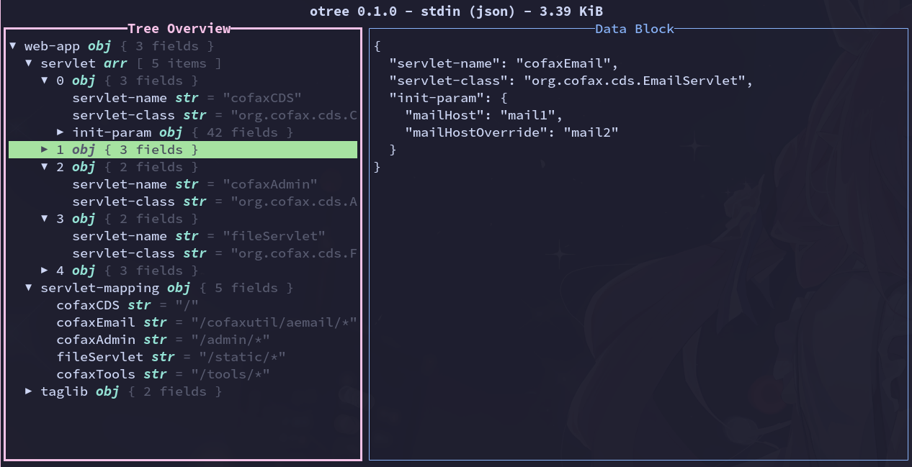

# OTree - Object Tree TUI Viewer



A command line tool to view objects (JSON/YAML/TOML) in TUI tree widget.

## Install

Download binary files from [release page](https://github.com/fioncat/otree/releases).

You can also build it from source (require `cargo` installed):

```bash
cargo install --git https://github.com/fioncat/otree
```

## Usage

Open a JSON/YAML/TOML file in TUI tree viewer:

```bash
otree /path/to/file.json
otree /path/to/file.yaml
otree /path/to/file.toml
```

For more command usage, please run `otree --help`.

You can configure TUI keys, colors, and more in `~/.config/otree.toml`, the default configuration is [here](config/default.toml).

For all available actions and their default key bindings, please refer to: [All Available Actions](docs/actions.md).

For how to configure TUI colors, please refer to: [Colors Document](docs/colors.md).

## Coming soon

New actions:

- `ShowHelp`: Popup a widget to show available keys.
- `SearchItems`: Search items.
- `SearchContent`: Search contents.

New features:

- Add foot widget to show help message and version.
- Syntax highlight in data block.
- Mouse select in data block.
- Clipboard support: Copy selected item field or content to clipboard.
